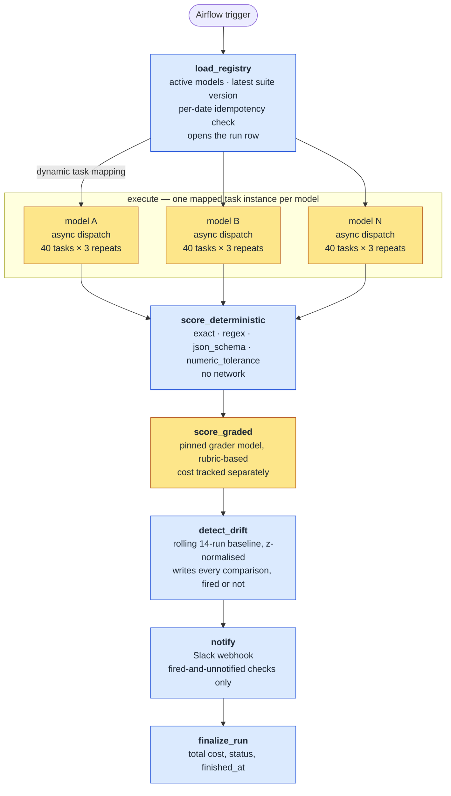
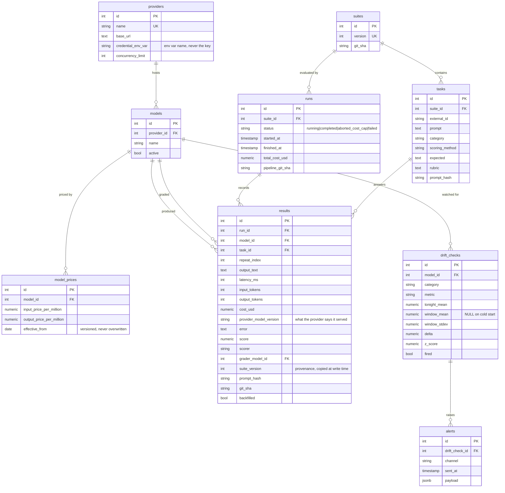

# DriftWatch — Model Drift & Cost Watchdog

A scheduled evaluation pipeline that re-benchmarks LLM providers against a fixed
task suite, scores every response, and raises an alert when quality moves further
than recent history's own variance can explain — so a silent model swap or a
quality regression is something you are told about, not something a user finds
first.

**Stack:** Apache Airflow 3.x · Python 3.12 · asyncio + httpx · PostgreSQL 16 ·
SQLAlchemy 2.x + Alembic · Docker Compose · pytest

> **Status:** built and verified locally against real providers (OpenAI,
> Anthropic) on a real Postgres and Airflow stack. Runs are triggered manually on
> a development machine; see [Scope and boundaries](#scope-and-boundaries).

---

## Contents

- [The problem](#the-problem)
- [Architecture](#architecture)
- [Drift detection](#drift-detection)
- [Measured results](#measured-results)
- [Data model](#data-model)
- [Technology choices](#technology-choices)
- [Getting started](#getting-started)
- [Testing](#testing)
- [Index decisions](#index-decisions)
- [Scope and boundaries](#scope-and-boundaries)
- [Repository layout](#repository-layout)

---

## The problem

A hosted model is not a fixed component. Providers update the weights behind a
stable name, change default sampling behaviour, and revise pricing — none of
which produces an error. The API keeps returning `200`, the text keeps reading
fluently, and the quality of what comes back has moved.

Teams rarely notice, because evaluation is usually something done once before
shipping rather than a system that runs whether or not anyone is watching. This
project treats evaluation as infrastructure: it runs on a schedule, retains every
raw record, and reports when something changed.

---

## Architecture

The nightly DAG is a linear chain with one fan-out stage. `load_registry` returns
one work item per active model, and Airflow's dynamic task mapping expands
`execute` into one task instance per model, each running its own bounded-
concurrency async dispatch loop.



<sub>Amber stages call a provider. Blue stages read only what is already
stored.</sub>

Two properties fall out of this shape:

**Provider calls happen in exactly two places.** The `execute` stage calls the
models under test; `score_graded` calls the pinned grader, which is why it is a
separate stage rather than folded into scoring — its cost stays separately
attributable. Everything downstream is a pure function over stored data, so a
scoring bug costs a re-run of one stage, not another night's spend.

**Re-triggering a date is safe.** `load_registry` refuses to open a second run
for a calendar date that already has a `completed` or `aborted_cost_cap` run and
raises `AirflowSkipException`, which propagates as a clean skip rather than a
failure. Within a run, a `UNIQUE (run_id, model_id, task_id, repeat_index)`
constraint enforces the same guarantee at the database level rather than in
application logic.

Each task runs **three times per model** per night, because temperature 0 is an
assumption about determinism rather than a guarantee of it.

**Scorers are pure and total.** The four deterministic scorers — `exact`,
`regex`, `json_schema`, `numeric_tolerance` — take a stored output and a task
definition and return a score; none of them raises. A malformed output or an
invalid pattern in a task definition scores 0.0 with the reason recorded, rather
than throwing an exception that would end the batch over one bad row.

### Cost control

A per-run cap (`NIGHTLY_COST_CAP_USD`) is checked against the run's committed
spend before every call and again after every write. On breach, the run is marked
`aborted_cost_cap` and the dispatch loop stops issuing calls — every row already
written stays intact and scoreable. Results are committed one at a time rather
than batched, so an interrupted run leaves complete records rather than a lost
buffer.

### Backfill

A second DAG re-scores retained history when a task's scoring method changes —
for example when a rubric-graded task turns out to have a checkable answer shape
after all. It reads stored outputs, applies the new deterministic scorer, and
writes new rows marked `backfilled=True` with `cost_usd = 0`, since no provider
call produced them. It refuses non-deterministic methods outright, which keeps
the "no downstream provider calls" property true by construction.

---

## Drift detection

Per `(model, category)`, tonight's mean score is compared against the trailing
window's own mean and standard deviation:

```
z = (tonight_mean − window_mean) / max(window_stdev, ε)
```

Normalising by the window's own variance rather than a fixed percentage means a
naturally noisy category has to move further to fire than a naturally stable one.

| Parameter | Value | Rationale |
|---|---|---|
| Window | 14 runs | Two weeks of history, recent enough to track genuine shifts |
| Minimum baseline | 7 runs | Below this, no comparison is made and the row records why |
| Threshold | \|z\| ≥ 3.0 | Tuned against synthetic drift and noise data, not assumed |

Two behaviours matter more than the formula:

**A version change resets the baseline.** The window is built by walking backward
from the most recent run and stopping at the first `provider_model_version`
mismatch, so scores produced by an older model version are never averaged into
the baseline for a new one.

**Non-events are recorded.** Every comparison writes a `drift_checks` row whether
or not it fired, including cold starts and version resets, where the statistical
columns are `NULL` to distinguish *"checked and found nothing"* from *"had
insufficient history to check."* Storing the non-events is what makes a
false-positive rate measurable rather than assertable.

---

## Measured results

Measured by running the pipeline against OpenAI and Anthropic — not projected.

| Measurement | Result |
|---|---|
| Full nightly-style run (4 models × 40 tasks × 3 repeats) | **480/480 results written, 0 failures**, run marked `completed` |
| Total provider cost for that run | **$0.1134** |
| Graded scoring (6 rubric tasks × 4 models) | **72 rows, $0.0305**, tracked separately from deterministic cost |
| Drift detector false-positive rate (100 simulated noise runs) | **3.23%** (target: under 5%) |
| Drift detector latency (injected 15% quality drop) | **fires within 2 runs**, correct direction |
| Cost cap, tested end to end | capped at $0.0005 → **aborted cleanly at 5/480 rows**, all rows intact |
| `results` query buffer reads, before/after indexing | **2,069 → 424** (~5×), ~18–53 ms → ~8 ms |
| Test suite | **45 tests passing** (unit, mock-server integration, live-DB statistical validation) |
| Provider version strings captured | `gpt-4o-mini-2024-07-18`, `claude-sonnet-4-5-20250929` — the exact field this project exists to watch |

---

## Data model

Nine tables. Prices, suites, and tasks are versioned so that a result can always
be interpreted against the definition that produced it.



Three schema decisions worth calling out:

- **Money is `Numeric`, never `float`.** Token costs are small enough that
  floating-point rounding error would be visible in a 90-day total.
- **Provenance is copied, not joined.** `results` stores the suite version,
  prompt hash, and pipeline git SHA at write time, so a stored result still shows
  what was true when it ran even after the task definition moves on.
- **No Postgres `ENUM` types.** Plain `String` for `runs.status` and
  `tasks.scoring_method`, so adding a value is a code change rather than an
  `ALTER TYPE` migration.

---

## Technology choices

| Layer | Choice | Why |
|---|---|---|
| Orchestration | Airflow 3.x, `LocalExecutor` | Dynamic task mapping, retries, and dependency graphs — the core skill this project demonstrates |
| Language | Python 3.12 | |
| Concurrency | `asyncio` + `httpx.AsyncClient` | Provider calls are IO-bound; a semaphore per provider caps concurrency from the provider's own registry row |
| Database | PostgreSQL 16 | Results store and Airflow's metadata as deliberately separate databases in one instance |
| Access layer | SQLAlchemy 2.x + Alembic | Typed models, versioned migrations |
| Packaging | uv | Lockfile committed, environment reproducible |
| Containers | Docker + Compose | Scheduler, dag-processor, api-server, Postgres in one command |
| Tests | pytest + pytest-asyncio | Including a real local mock provider server and live-database statistical tests |

---

## Getting started

```bash
git clone <this repo>
cd driftwatch
cp .env.example .env          # fill in real values — see below

uv sync
docker compose up --build -d

uv run alembic upgrade head
uv run python seed.py
uv run python suite_loader.py suites/v3.yaml    # latest suite version
```

Airflow UI at `http://localhost:8080` (`airflow` / `airflow`, development only).
Trigger from the UI, or:

```bash
docker compose exec airflow-scheduler airflow dags trigger nightly_pipeline
```

### Configuration

| Variable | Purpose |
|---|---|
| `OPENAI_API_KEY`, `ANTHROPIC_API_KEY` | Provider credentials, referenced by name from the `providers` table |
| `SLACK_WEBHOOK_URL` | Optional — alerting no-ops without it |
| `NIGHTLY_COST_CAP_USD` | Hard spend ceiling per run |
| `WATCHDOG_DATABASE_URL` | Host-side connection string; containers get their own via `docker-compose.yml`, since `localhost` means something different inside a container |

---

## Testing

```bash
uv run pytest tests/
```

Three layers:

1. **Unit** — scorers, cost arithmetic, backoff timing. No network, no database.
2. **Integration against a real local mock provider** — a genuine
   `http.server.ThreadingHTTPServer` on a random port, not a mocked transport
   object, so retry and timeout handling are exercised against real TCP rather
   than a hand-built response.
3. **Statistical validation against a live database** — the drift detector's
   tests generate synthetic history (an injected step drop; 100 runs of pure
   noise) directly in Postgres and measure the actual false-positive rate and
   detection latency, rather than asserting a number that was never checked.

---

## Index decisions

The 90-day cost-and-quality history query (`docs/history_query.sql`) filters
`results` by one `model_id` over a `created_at` range, grouped by day. It was
measured with `EXPLAIN (ANALYZE, BUFFERS)` against a realistic volume — 150
nights, ~72,500 rows, generated specifically for the measurement, since the real
table alone was too small to show a difference.

**Before** (`docs/explain-before.txt`), the planner chose a **sequential scan**:
every row in the table, 2,069 buffer hits, to filter down to roughly 10,800
matching rows, in 18–53 ms depending on cache state. That was not a planner
mistake — at that table size, scanning everything genuinely was cheaper than the
alternatives available to it. But it means the query's cost scales with the
*total* size of `results` forever, not with the size of the answer. The same
90-day window returns roughly the same number of rows every night, yet would get
measurably slower every night purely because the table keeps growing underneath
it.

**After** adding `results (model_id, created_at DESC)` — an index whose shape
matches the query's own access pattern, filter by one model then range over time
— the plan switched to a **Bitmap Index Scan** (`docs/explain-after.txt`): read
matching row locations out of the index first, then fetch only those table pages,
instead of reading every page unconditionally.

| | Buffer reads | Execution time | Plan |
|---|---|---|---|
| Before | 2,069 | ~18–53 ms | Seq Scan |
| After | 424 | ~8 ms | Bitmap Index Scan |

The second index, `results (run_id, model_id)`, does not appear in this plan; it
serves the scoring stage's own pattern — unscored rows for one run, joined to
`models` for grader attribution. The same reasoning applies to both: an index
does not make Postgres faster in the abstract, it hands the planner a shortcut
whose shape matches how the application actually asks its questions. Both were
guessed at first, then confirmed against what `EXPLAIN` actually reported.

---

## Scope and boundaries

What the system does, and the limits that are deliberate rather than pending:

- **Local execution, manual trigger.** The DAG is defined with `schedule=None`;
  what cadence it runs on is a deployment decision, not a property of the
  pipeline. Everything documented here — the provider calls, the database, the
  measurements — is real, and it runs on a development machine.
- **Nightly batch by design.** A regression introduced this morning is caught on
  the next run, not the moment it occurs. Detection operates on aggregate
  behaviour across a full suite, which is what makes it robust to single-response
  noise.
- **A purpose-built suite.** The 40 tasks are written for this project and
  versioned as immutable snapshots. It measures what it measures; agreement with
  any public benchmark is not claimed.
- **Graded scoring inherits the grader's own stability.** The grader is pinned to
  a specific version and is itself evaluated by the suite like any other model,
  so a grader-wide shift is visible in the data — mitigation, not a guarantee of
  grader correctness.
- **Three repeats per task, not one.** Temperature 0 is an assumption about
  determinism rather than a guarantee, so each task is sampled repeatedly and
  compared on its mean.
- **Costs are computed, not invoiced.** Prices are entered from each provider's
  published rates and versioned by `effective_from`. The figures closely track
  the real bill; they are not a reconciled invoice.

---

## Repository layout

```
src/watchdog/
  db/          SQLAlchemy models, session and engine setup
  providers/   Async HTTP client, retry/backoff, cost arithmetic
  scoring/     Deterministic scorers and graded (pinned-grader) scoring
  drift/       Rolling-window z-score detector
  notify/      Slack webhook alerting
  dags/        nightly_pipeline (7 stages) and backfill (separate DAG)
tests/         Unit, mock-server integration, live-DB statistical tests
suites/        Versioned YAML task suites (v1–v3, each a full snapshot)
docs/          The 90-day history query and committed EXPLAIN before/after output
scripts/       Verification scripts (first live call, test alert, synthetic
               load generation for the index measurement)
alembic/       Migrations
```
